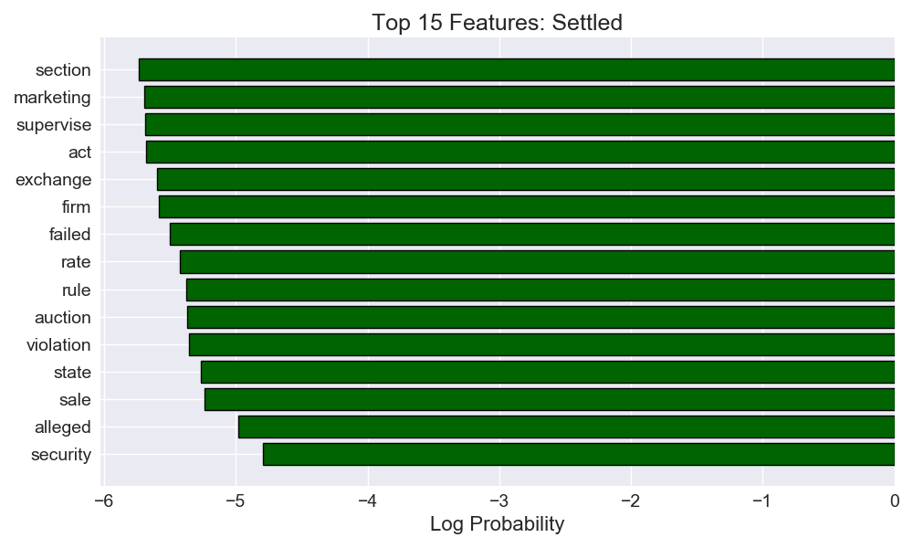

START WITH 2 TARGETS.

Target: 0, name: Favorable
Top 10 tokens:  ['account', 'activity', 'related', 'use', 'controversy', 'involved', 'brch', 'dt', 'fiduciary', 'misrepresentation']

Target: 1, name: Unfavorable
Top 10 tokens:  ['rule', 'firm', 'security', 'failed', 'nasd', 'alleged', 'violation', 'report', 'order', 'transaction']

The accuracy on the Favorable/Unfavorable test set is 0.992.

NOW LOADING 3 TARGETS.

Target: 0, name: Favorable
Top 10 tokens:  ['account', 'activity', 'related', 'use', 'controversy', 'involved', 'brch', 'dt', 'fiduciary', 'misrepresentation']

Target: 1, name: Settled
Top 10 tokens:  ['security', 'alleged', 'sale', 'state', 'violation', 'auction', 'rule', 'rate', 'failed', 'firm']

Target: 2, name: Unfavorable
Top 10 tokens:  ['rule', 'firm', 'failed', 'nasd', 'security', 'report', 'transaction', 'order', 'violation', 'finra']

The accuracy on the Favorable/Settled/Unfavorable test set is 0.862.

NOW LOADING 12 TARGETS.

Target: 0, name: Decision
Top 10 tokens:  ['rule', 'firm', 'nasd', 'failed', 'report', 'transaction', 'security', 'order', 'violation', 'finra']

Target: 1, name: Acceptance, Waiver & Consent(AWC)
Top 10 tokens:  ['security', 'sale', 'state', 'auction', 'rate', 'alleged', 'marketing', 'supervise', 'registered', 'failed']

Target: 2, name: Order
Top 10 tokens:  ['rule', 'nyse', 'exchange', 'violation', 'firm', 'violated', 'alleged', 'conversion', 'failed', 'unknown']

Target: 3, name: Settled
Top 10 tokens:  ['rule', 'firm', 'exchange', 'failed', 'violation', 'security', 'alleged', 'section', 'order', 'customer']

Target: 4, name: Judgment Rendered
Top 10 tokens:  ['security', 'state', 'ga', 'fund', 'sale', 'failure', 'supervise', 'alleges', 'firm', 'practice']

Target: 5, name: Other
Top 10 tokens:  ['account', 'activity', 'related', 'use', 'controversy', 'involved', 'brch', 'dt', 'fiduciary', 'misrepresentation']

Target: 6, name: Consent
Top 10 tokens:  ['complaint', 'security', 'act', 'commission', 'sec', 'alleges', 'alleged', 'defendant', 'fund', 'exchange']

Target: 7, name: Decision & Order of Offer of Settlement
Top 10 tokens:  ['security', 'research', 'act', 'state', 'firm', 'failed', 'order', 'wa', 'section', 'auction']

Target: 8, name: Stipulation and Consent
Top 10 tokens:  ['pay', 'respondent', 'failed', 'fee', 'case', 'finra', 'arbitration', 'cost', 'fine', 'suspension']

Target: 9, name: Withdrawn
Top 10 tokens:  ['alleged', 'security', 'violation', 'rule', 'ar', 'certain', 'research', 'exchange', 'violated', 'failed']

Target: 10, name: Dismissed
Top 10 tokens:  ['nyse', 'rule', 'exchange', 'alleged', 'firm', 'florida', 'security', 'state', 'violated', 'branch']

Target: 11, name: Favorable for Broker
Top 10 tokens:  ['filed', 'registered', 'filing', 'formal', 'complaint', 'financials', 'bhsi', 'mv', 'applicant', 'rule']

The accuracy on the Favorable/Settled/Unfavorable test set is 0.742.

Favorable                                    |  Unfavorable
:-------------------------------------------:|:----------------------------------------------:
  |  

Favorable                                    |  Settled                                       | Unfavorable
:-------------------------------------------:|:----------------------------------------------:|:----------------------------------------------:
  |       | 