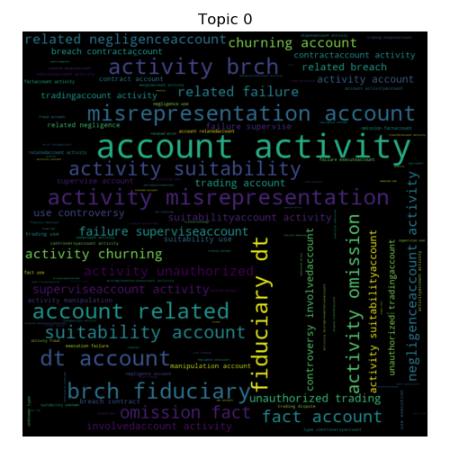
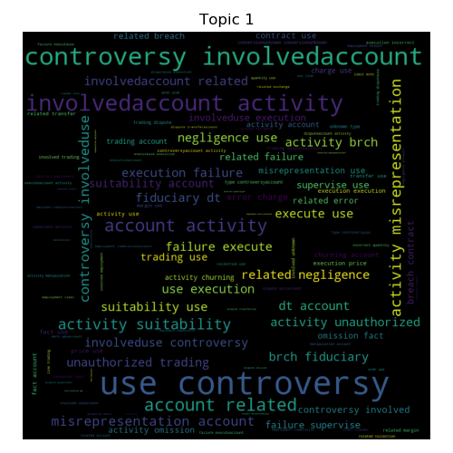
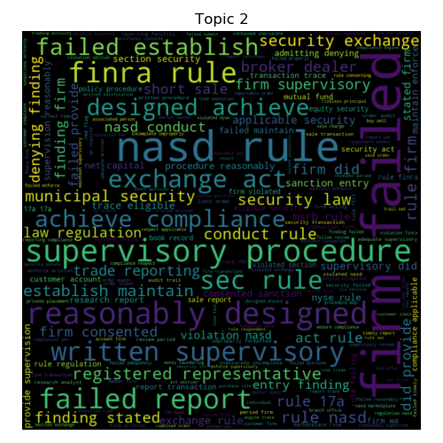
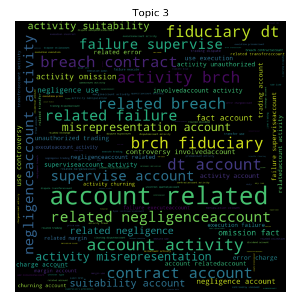
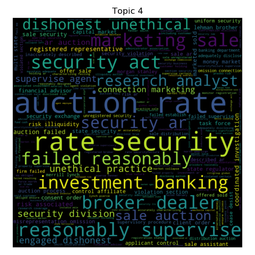
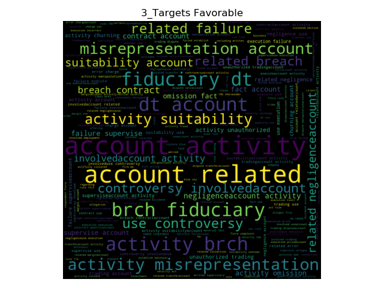
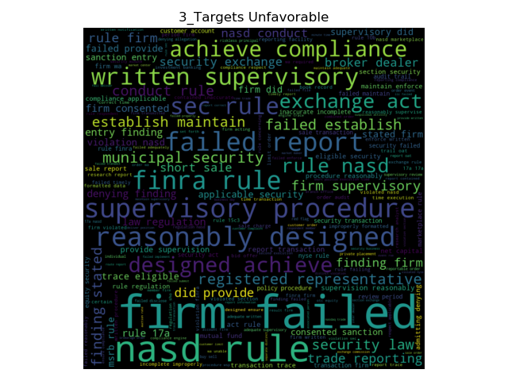

# Intro to FINRA Topics
                 |  
:-------------------------------------------:|:----------------------------------------------: 

## Problem Framing
In consultation with a law firm here in the Denver Metro Area, I sought to provide a tool for use in client-counseling in the context of a pending FINRA arbitration. 

## What is FINRA?
FINRA is a quasi-governmental regulatory body authorized by Congress to protect America’s investors by making sure the broker-dealer industry operates fairly and honestly. We oversee more than 634,000 brokers across the country—and analyze billions of daily market events.

## The DataSet
This DataSet contained over 27,232 FINRA Arbitration records from 1964 through 2018. It contained the fields of:
- `firm `: the securities firm involved
- `crd`: the central registration number of that firm
- `address`: firm's address 
- `date_initiated`: date that the complaint was filed with FINRA (fka: NASD prior to 2004) 
- `resolution_date`: date complaint was resolved
- `allegations`: allegations that make up the complaint
- `resolution`: outcome of the complaint - 12 possibilities
- `sanctions`: sanctions awarded if any
- `sanction_details`: detail of the sanctions including award amount, suspension length, etc. 

I wanted to focus on determining whether it is possible to predict the outcome of a FINRA arbitration from the text of the allegations made against them. To do this I first cleaned the data with `src/clean.py`. I knew upfront that there was likely to be too many possible outcomes with 12 distinct possibilities, so I engineered two additional features to add to the DataSet that are the resolution with only 3 outcomes: Favorable, Settled, and Unfavorable; and resolution with only 2 outcomes: Favorable and Unfavorable. There were about 300 entries to the DataSet that were missing key data to continue analysis, they were discarded.  

## EDA
|Allegations                                 |  Resolutions
:-------------------------------------------:|:----------------------------------------------:
    |

After I cleaned the DataFrame, I cleaned and processed the text for analysis, hoping to see wordclouds that allowed me to see if there were any stopwords that needed to come out in addition to those that I had already removed. I created wordclouds of the entire `allegations` corpus and for the features that I had created with two and three possible resolutions. I knew that looking at it with all 12 categories would get confusing, it made it seem like the most likely outcome was favorable for the broker, when the opposite is true. About 16,000 resulted in some adverse action for the broker, whether agreed to or adjudicated by the arbitrator. On the other hand, about 10,000 had favorable outcomes for the broker. 

Favorable                                    |  Unfavorable
:-------------------------------------------:|:----------------------------------------------:
 |  

# Modeling

Seeing that there is a noticeable distinction in the words that were found on the favorable and unfavorable targets, I wanted to see if I could narrow down the overall Topics within the corpus.

## NLP with Non-Negative Matrix Factorization
I passed the corpus through a processing pipeline, and through NMF. I tried several varying numbers of features, then I got the following results with 5 features: 
 

I then consulted with the founder of one of the preeminent law firms that is dedicated to representing Broker-Dealers. He confirmed that these topics looked correct and correlated to the types of cases he sees. Together we maned them:

TOPIC 0: `Misrepresentation/Breach of Fiduciary Duty`

 

TOPIC 1: `Trade Violation`

 

TOPIC 2: `Violation of Law`

 

TOPIC 3: `Reporting Violation`

 

TOPIC 4: `Auction Rate Securities` 

 


## Naive Bayes

I then moved onto a Naive Bayes model to see if I could predict the resolution of the case based on the corpus of the `allegations`. For the target of `resolutions` it included all 12 possible outcomes of the initial allegation. 

```
START BY LOADING ALL 12 TARGETS.

Target: 0, name: Decision
Top 10 tokens:  ['rule', 'firm', 'nasd', 'failed', 'report', 'transaction', 'security', 'order', 'violation', 'finra']

Target: 1, name: Acceptance, Waiver & Consent(AWC)
Top 10 tokens:  ['security', 'sale', 'state', 'auction', 'rate', 'alleged', 'marketing', 'supervise', 'registered', 'failed']

Target: 2, name: Order
Top 10 tokens:  ['rule', 'nyse', 'exchange', 'violation', 'firm', 'violated', 'alleged', 'conversion', 'failed', 'unknown']

Target: 3, name: Settled
Top 10 tokens:  ['rule', 'firm', 'exchange', 'failed', 'violation', 'security', 'alleged', 'section', 'order', 'customer']

Target: 4, name: Judgment Rendered
Top 10 tokens:  ['security', 'state', 'ga', 'fund', 'sale', 'failure', 'supervise', 'alleges', 'firm', 'practice']

Target: 5, name: Other
Top 10 tokens:  ['account', 'activity', 'related', 'use', 'controversy', 'involved', 'brch', 'dt', 'fiduciary', 'misrepresentation']

Target: 6, name: Consent
Top 10 tokens:  ['complaint', 'security', 'act', 'commission', 'sec', 'alleges', 'alleged', 'defendant', 'fund', 'exchange']

Target: 7, name: Decision & Order of Offer of Settlement
Top 10 tokens:  ['security', 'research', 'act', 'state', 'firm', 'failed', 'order', 'wa', 'section', 'auction']

Target: 8, name: Stipulation and Consent
Top 10 tokens:  ['pay', 'respondent', 'failed', 'fee', 'case', 'finra', 'arbitration', 'cost', 'fine', 'suspension']

Target: 9, name: Withdrawn
Top 10 tokens:  ['alleged', 'security', 'violation', 'rule', 'ar', 'certain', 'research', 'exchange', 'violated', 'failed']

Target: 10, name: Dismissed
Top 10 tokens:  ['nyse', 'rule', 'exchange', 'alleged', 'firm', 'florida', 'security', 'state', 'violated', 'branch']

Target: 11, name: Favorable for Broker
Top 10 tokens:  ['filed', 'registered', 'filing', 'formal', 'complaint', 'financials', 'bhsi', 'mv', 'applicant', 'rule']

The accuracy on the Favorable/Settled/Unfavorable test set is 0.742.
```

Decision                                     |  Acceptance, Waiver & Consent(AWC)             | Order
:-------------------------------------------:|:----------------------------------------------:|:----------------------------------------------:
  |          | 

Settled                                      |  Judgment Rendered                             | Other
:-------------------------------------------:|:----------------------------------------------:|:----------------------------------------------:
   |  | 

Consent                                      |  Decision & Order of Offer of Settlement       | Stipulation and Consent
:-------------------------------------------:|:----------------------------------------------:|:----------------------------------------------:
   |          | 

Withdrawn                                    |  Dismissed                                     | Favorable for Broker
:-------------------------------------------:|:----------------------------------------------:|:----------------------------------------------:
 |    | 

These results were fairly accurate, but I wanted to see if I could do better, so I narrowed the scope to three targets: Favorable, Settled, and Unfavorable:

```
NARROW TO 3 TARGETS.

Target: 0, name: Favorable
Top 10 tokens:  ['account', 'activity', 'related', 'use', 'controversy', 'involved', 'brch', 'dt', 'fiduciary', 'misrepresentation']

Target: 1, name: Settled
Top 10 tokens:  ['security', 'alleged', 'sale', 'state', 'violation', 'auction', 'rule', 'rate', 'failed', 'firm']

Target: 2, name: Unfavorable
Top 10 tokens:  ['rule', 'firm', 'failed', 'nasd', 'security', 'report', 'transaction', 'order', 'violation', 'finra']

The accuracy on the Favorable/Settled/Unfavorable test set is 0.862.
```
Favorable                                    |  Settled                                       | Unfavorable
:-------------------------------------------:|:----------------------------------------------:|:----------------------------------------------:
  |       | 
 |      | 

These results were even better, but I wanted to focus it a bit more, so I incorporates all settled resolutions into unfavorable, since inherently this means that the broker agreed to some sort of sanctions. 

```
NOW WITH 2 TARGETS.

Target: 0, name: Favorable
Top 10 tokens:  ['account', 'activity', 'related', 'use', 'controversy', 'involved', 'brch', 'dt', 'fiduciary', 'misrepresentation']

Target: 1, name: Unfavorable
Top 10 tokens:  ['rule', 'firm', 'security', 'failed', 'nasd', 'alleged', 'violation', 'report', 'order', 'transaction']

The accuracy on the Favorable/Unfavorable test set is 0.942.
```
Favorable                                    |  Unfavorable
:-------------------------------------------:|:----------------------------------------------:
  |  
 |  

There relatively balanced classes in this case, with 10,000 favorable results and 16,000 unfavorable results. 39% Favorable and 61% Unfavorable. 

### Naive Bayes by Topics
I also wanted to incorporate the topics that I had created earlier as a feature, so I ArgSorted the topics for each document and assigned each document a topic that it correlated to the most. 
```
TOPIC 0 Misrepresentation/Breach of Fiduciary Duty. The accuracy on the Misrepresentation/Breach of Fiduciary Duty Topic set is 0.997.

Target: 0, name: Favorable
Top 10 tokens:  ['account', 'activity', 'related', 'misrepresentation', 'dt', 'fiduciary', 'brch', 'suitability', 'omission', 'fact']
Target: 1, name: Unfavorable
Top 10 tokens:  ['unregistered', 'dealer', 'broker', 'branch', 'activity', 'allegation', 'suitability', 'engaged', 'customer', 'salesperson']

TOPIC 1 Trade Violation . The accuracy on the Trade Violation Topic set is 0.964.

Target: 0, name: Favorable
Top 10 tokens:  ['account', 'use', 'activity', 'controversy', 'involved', 'related', 'misrepresentation', 'suitability', 'execution', 'failure']
Target: 1, name: Unfavorable
Top 10 tokens:  ['conversion', 'unknown', 'filing', 'allegation', 'asked', 'action', 'administrative', 'marked', 'reported', 'previously']

TOPIC 2  Violation of Law. The accuracy on the Violation of Law Topic set is 0.987.

Target: 0, name: Favorable
Top 10 tokens:  ['firm', 'complaint', 'rule', 'alleges', 'act', 'exchange', 'section', 'violation', 'finra', 'security']
Target: 1, name: Unfavorable
Top 10 tokens:  ['rule', 'firm', 'failed', 'nasd', 'security', 'violation', 'report', 'order', 'transaction', 'alleged']

TOPIC 3 Reporting Violation. The accuracy on the Reporting Violation Topic set is 0.996.

Target: 0, name: Favorable
Top 10 tokens:  ['account', 'related', 'activity', 'negligence', 'brch', 'dt', 'fiduciary', 'breach', 'contract', 'failure']
Target: 1, name: Unfavorable
Top 10 tokens:  ['alleged', 'quotation', 'market', 'reasonably', 'prevailing', 'nasdaq', 'procedure', 'trade', 'resident', 'make']


TOPIC 4 Auction Rate Securities. The accuracy on the Auction Rate Securities Topic set is 0.977.

Target: 0, name: Favorable
Top 10 tokens:  ['unsuitable', 'alleges', 'security', 'plaintiff', 'fund', 'failure', 'state', 'investment', 'sale', 'alleged']
Target: 1, name: Unfavorable
Top 10 tokens:  ['security', 'sale', 'auction', 'state', 'alleged', 'rate', 'supervise', 'failure', 'marketing', 'ar']
```

## Principal Component Analysis

I moved on to PCA because I wanted to ensure that there was actually some structure to my data since I seemed to be getting very good results. Given that PCA can find latent topics, it seemed like a good way to reduce dimensionality and find some additional structure to the data. It is clear that there is a cluster within the the results favorable to the broker. That correlation is not as strong with settlements, but it is still there. 


2 Targets                                    |  3 Targets
:-------------------------------------------:|:----------------------------------------------:
                |  
           |  

I also saw some good structure with looking at the PCA by the Topics that I created using NMF. 
2D by Topic                                  |  3D by Topic 
:-------------------------------------------:|:----------------------------------------------:
              |  
<<<<<<< HEAD

There is obviously some structure to the data, while two and three principle components only account for 21% and 24% of the variance, respectively, it is clear that there is still significant structure to this data. 

# Conclusion 

Using a Naive Bayes Model you can fairly accurately predict whether or not an allegation against a securities broker would result in an unfavorable result for that broker. With an accurate prediction, an attorney can best represent his client at an arbitration or drive settlement negotiations if it is highly likely to receive an unfavorable result. 

